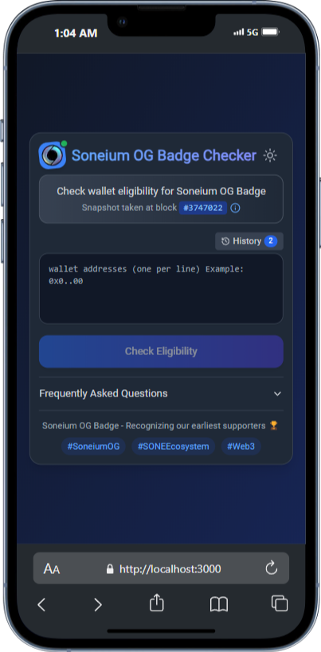

# Soneium OG Badge Eligibility Checker

<div align="center">
  
  
</div>


A web-based tool to check if your wallet address is eligible for the Soneium OG Badge. The eligibility is determined based on transactions before block #3747022 on the Soneium blockchain.

## 🔗 Live Demo

[**Check Your Eligibility Now**](https://soneium-og-badge-checker.vercel.app/)

## ✨ Features

- **Batch Checking**: Verify multiple wallet addresses at once
- **Real-time Validation**: Instant feedback on wallet eligibility
- **Export Results**: Download your results as CSV for record keeping
- **Dark/Light Mode**: Choose your preferred theme
- **Mobile Responsive**: Works on all device sizes
- **Search & Filter**: Easily search through checked addresses
- **History Tracking**: Quick access to previously checked addresses

## 🛠️ Technologies

- Next.js 14
- React
- TailwindCSS
- Lucide Icons
- Vercel (Hosting)

## 📊 About Soneium OG Badge

The Soneium OG Badge is a special recognition for early supporters and contributors to the Soneium ecosystem. Eligible wallets must have conducted transactions on the Soneium network before block #3747022.

### Benefits include:
- Early access to new features
- Exclusive airdrops
- Special governance rights
- Community recognition

## 📋 Usage Instructions

1. Enter one or more wallet addresses (one per line) in the input field
2. Click "Check Eligibility" to verify all addresses
3. Review the results showing which wallets are eligible
4. Filter results or export as needed

## 🖼️ Screenshots

### Light Mode


### Dark Mode


### Results Dashboard


## 🚀 Local Development

```bash
# Clone the repository
git clone https://github.com/YourUsername/soneium-og-badge-checker.git

# Navigate to the project directory
cd soneium-og-badge-checker

# Install dependencies
npm install

# Start development server
npm run dev
