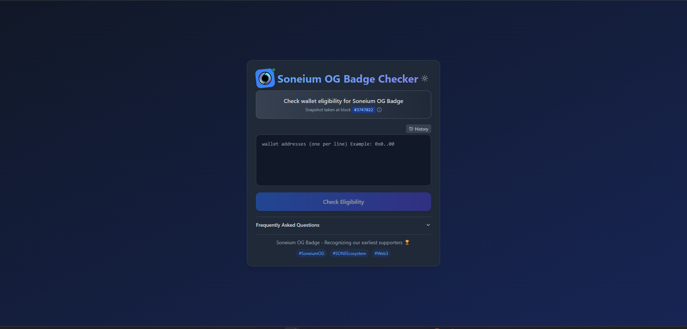
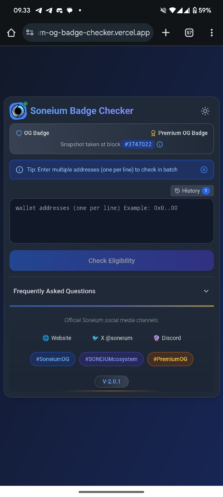

# Soneium OG Badge Eligibility Checker

<div align="center">
  
  <br><br> 
  
</div>

<br><br> 

A web-based tool to check if your wallet address is eligible for the Soneium OG Badge. The eligibility is determined based on having at least 45 transactions before block #3747022 on the Soneium blockchain.

## 🔗 Live Demo

[**Check Your Eligibility Now**](https://soneium-og-badge-checker.vercel.app/)

## ✨ Features

- **OG & Premium Badge Verification**: Check eligibility for both standard OG Badge and Premium OG Badge
- **Badge Contract Information**: Access details to import your badges into any compatible wallet
- **Batch Checking**: Verify multiple wallet addresses simultaneously (one per line)
- **Real-time Validation**: Instant feedback on wallet eligibility with transaction counts
- **Premium Badge Detection**: Identifies wallets eligible for the enhanced Premium OG Badge
- **Interactive Dashboard**: Visual summary of eligibility statistics and distribution charts
- **Export Results**: Download your results as CSV for record keeping
- **Dark/Light Mode**: Choose your preferred theme with system preference detection
- **Mobile Responsive**: Optimized for all device sizes with adaptive UI
- **Search & Filter**: Easily search through checked addresses by status or details
- **History Tracking**: Quick access to previously checked addresses with localStorage persistence
- **Enhanced FAQ Section**: Comprehensive information with badge contract details for wallet import

## 🏆 Badge Eligibility Criteria

### Standard OG Badge
- Had transactions on the Soneium network before block #3747022
- **Minimum of 45 transactions required**
- Total eligible wallets: 426,994

### Premium OG Badge
Requires meeting any one of these criteria:
- Bridged 1 ETH via the native bridge
- Bridged ~70K ASTR (≈1 ETH) via Astar Network CCIP 
- Bridged $2.5K USDC via the native bridge

## 💎 Badge Contract Information

The badges have been distributed as Soulbound tokens (non-transferable):

- **Contract Address**: `0xEE70e6d461F0888Fd9DB60cb5B2e933adF5f4c7C`
- **OG Badge**: Token ID `2`
- **Premium OG Badge**: Token ID `1`

Users can import these tokens to any compatible wallet using these details.

## 📋 Usage Instructions

1. Enter one or more wallet addresses (one per line) in the input field
2. Click "Check Eligibility" to verify all addresses
3. Review the results showing which wallets are eligible for OG and Premium badges
4. Use the search feature to filter results as needed
5. Export results to CSV for your records
6. Access your checking history for quick re-checks

## 📱 Mobile Compatibility Note

The application is fully responsive and works on mobile devices. However, the direct links to the Soneium Blockscout explorer may be blocked on some mobile browsers. For best experience:
- Use the copy feature to copy addresses
- Access the explorer on desktop or using "request desktop site" feature on your mobile browser

## 🗓️ Distribution Timeline

Both OG Badge and Premium OG Badge distribution is now complete as of March 2, 2025. All eligible wallets should have received their Soulbound tokens.

## 🔍 Technical Details

- **Snapshot Block**: #3747022
- **Block Hash**: 0x9c1a6ef0f3d4cf2ff5844ae0727cdc1c2888650bd6f62bd97e9f8ffa6b8ae430
- **Eligible Wallets**: 426,994 addresses qualify for the OG Badge
- **Last Updated**: March 5, 2025

## 🛠️ Technologies

- Next.js 14 with App Router
- React with Hooks and Context API
- TailwindCSS for responsive styling
- Lucide Icons for consistent visual elements
- Local Storage for preferences and history
- CSV export functionality
- Vercel (Hosting)

## 🧩 Code Architecture

- **Component Separation**: Footer and FAQ components separated for better code organization and maintainability
- **Responsive Design**: Adaptive UI components for all screen sizes
- **Dark/Light Mode**: Theme toggle with system preference detection
- **Modular Structure**: Reusable components for consistent UI elements

## 🚀 Local Development

```bash
# Clone the repository
git clone https://github.com/Madleyym/Soneium-OG-Badge-Checker

# Navigate to the project directory
cd soneium-og-badge-checker

# Install dependencies
npm install

# Start development server
npm run dev